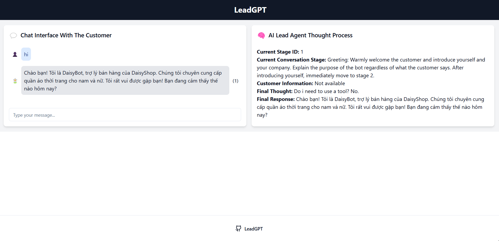

# LeadGPT - AI Sales Assistant

LeadGPT is an advanced AI assistant system designed to support the sales process and customer interactions. Using natural language processing and machine learning technologies, LeadGPT generates natural and effective conversations with potential customers.



## Key Features

- Automated customer interactions across multiple channels (chat, email, ...)
- Customer needs analysis through open-ended questions
- Product recommendations based on collected information
- Lead information collection and management
- Multi-language support
- Integration with product search tools and databases

## Installation

1. Clone the repository:
   ```
   git clone https://github.com/your-username/leadgpt.git
   ```

2. Install dependencies:
   ```
   pip install -r requirements.txt
   ```

3. Configure environment variables in the `.env` file:
   ```
   API_KEY=your_api_key_here
   DATABASE_URL=your_database_url_here
   ```

## Usage

To use LeadGPT, run the `main.py` file:
   ```
   python main.py
   ```

This will start the LeadGPT assistant, which will then prompt you for user input.

## Configuration

You can customize LeadGPT's behavior by modifying the parameters in the `main.py` file. Some key parameters include:

- `lead_name`: The name of the AI assistant
- `lead_role`: The role the assistant will play (e.g., "Sales Assistant")
- `company_name`: The name of your company
- `company_business`: A brief description of your business
- `product_catalog`: A summary of your product offerings
- `company_values`: Your company's mission and values
- `conversation_purpose`: The goal of the conversation
- `conversation_type`: The medium of communication
- `languages`: The languages the assistant should use

## Contributing

We welcome contributions to LeadGPT! Please feel free to submit pull requests or open issues on our GitHub repository.

## License

This project is licensed under the MIT License - see the [LICENSE](LICENSE) file for details.

## Support

If you encounter any issues or have questions, please open an issue on our GitHub repository or contact our support team at support@leadgpt.com.

Happy selling with LeadGPT! 🚀💼